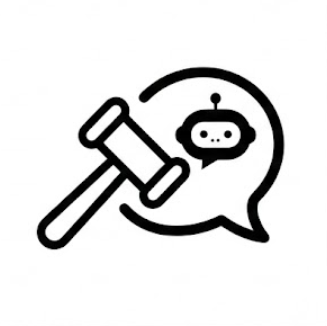
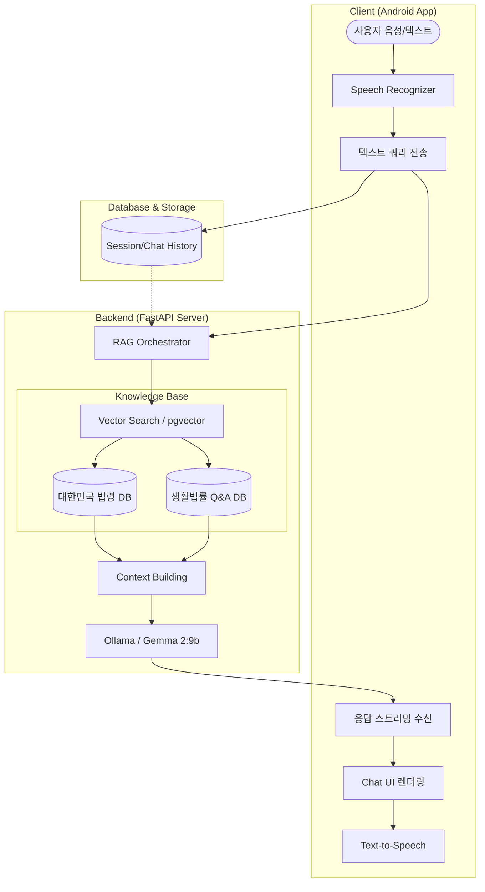

# ⚖️ BaroLaw (바로Law): 당신의 손안에 있는 법률 비서

> **"바르다(Right)"** + **"Law"** = 언제든 **"바로(Right Now)"** 도움을 주는 법률 상담 AI 서비스



## 🌟 프로젝트 개요
**BaroLaw**는 복잡하고 멀게만 느껴지는 법률 문제를 누구나 쉽고 빠르게 해결할 수 있도록 돕는 **AI 음성 챗봇**입니다.
이름의 유래처럼, 법률 정보를 **'바르게'** 정제하여 사용자에게 **'바로(지금 당장)'** 전달하는 것을 목표로 합니다. 딱딱한 법률 문구가 아닌 친절한 '해요체' 상담과 함께, 실제 대한민국 법령과 Q&A 데이터를 기반으로 실질적인 행동 요령을 제시합니다.

## 🛠️ 서비스 파이프라인 (Service Pipeline)

BaroLaw는 **Advanced Hybrid RAG** 아키텍처를 기반으로 정확하고 신뢰할 수 있는 법률 정보를 제공합니다.



## ✨ 주요 기능 (Key Features)

- **🎙️ 음성 인터페이스:** Android STT/TTS 연동을 통해 운전 중이나 위급 상황에서도 핸즈프리 상담 가능.
- **📚 멀티 데이터셋 RAG:** 7,000개 이상의 법령 조문과 1,000건 이상의 실제 상담 사례를 결합한 하이브리드 지식 베이스.
- **🛡️ 법적 출처 명시:** AI 답변 하단에 `⚖️ 법적 근거 및 참고 문헌` 섹션을 자동 생성하여 정보의 신뢰도 보장.
- **🤖 대화 세션 자동 요약:** 비동기 LLM 태스크를 통해 첫 질문을 분석, 채팅 목록에 깔끔한 제목(예: '중고거래 사기 대처') 자동 부여.
- **🎨 프리미엄 UX:** Jetpack Compose 기반의 다크 모드, 마크다운 렌더링, 텍스트 부분 복사 지원.

## 📱 앱 화면 미리보기

| 메인 가이드 화면 | 채팅 상담 화면 | 세션 관리 서랍 |
| :---: | :---: | :---: |
|  |  |  |

> ⚠️ 위 사진은 예시이며, 실제 앱 구동 화면으로 교체할 예정입니다.

## 🚀 시작하기 (Getting Started)

### 1. Backend (Server)
Docker를 통해 원클릭으로 서버 인프라를 구축할 수 있습니다.
```bash
# 컨테이너 실행
docker-compose up -d
```

### 2. Android (Client)
Android Studio 코끼리 버튼(Sync Project) 클릭 후 실행하세요.
- **Minimum SDK:** 26 (Android 8.0)
- **주요 기술:** Jetpack Compose, OkHttp (Streaming), Material 3

## 📜 기술 스택 (Tech Stack)

- **Frontend:** Kotlin, Jetpack Compose
- **Backend:** Python (FastAPI), httpx
- **AI/LLM:** Ollama (Gemma 2:9b), ko-sroberta-multitask
- **Database:** PostgreSQL 16 (pgvector)
- **DevOps:** Docker, Docker Compose, ngrok

---
© 2026 BaroLaw Team. All rights reserved.
