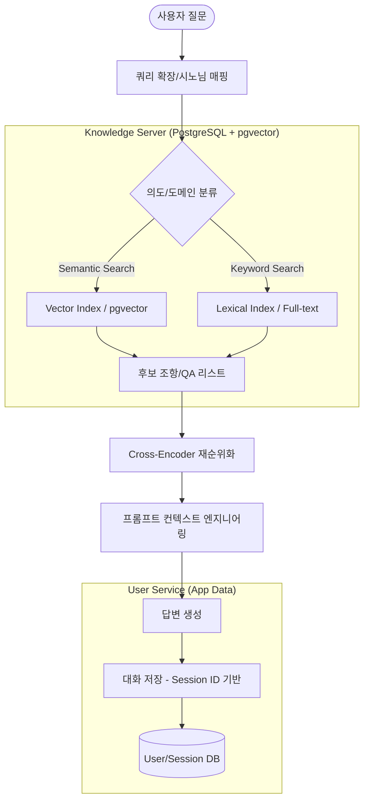

# Integrated Legal Advisor Project Implementation Plan

서민 생활 밀착형 법률 상담 서비스의 **RAG 최적화**, **토픽별 멀티 데이터셋**, 및 **단계적 확장형 멀티 RAG** 구축을 위한 통합 마스터 플랜입니다.

## 1. 시스템 아키텍처 (Advanced Hybrid RAG)

## 2. 핵심 구현 단계 (Phases)

### **Phase 1: 데이터셋 구축 ✅ 완료**

> 서민 타겟 4대 분야(교통/사기/부동산/형법)의 원천 데이터를 확보한다. **환각 Zero 원칙**에 따라 국가 공식 자료만 사용한다.

#### 1-1. 토픽별 법령 데이터 (Statute) ✅ 완료 (2026-03-01)
- [x] **교통 (Traffic)**: 도로교통법, 특가법 등 2,036개 조문 확보.
- [x] **경제 (Fraud)**: 특경법, 전자금융거래법 등 1,087개 조문 확보.
- [x] **부동산 (Estate)**: 임대차법, 집합건물법 등 656개 조문 확보.
- [x] **형법 (Criminal)**: 형법, 경범죄, 근로기준법 등 1,436개 조문 확보.
- **포맷**: `backend/data/statute/{topic}.parquet` (원본 조문 보존)

#### 1-2. 해석/Q&A 데이터 (Interpretation Guide) ✅ 완료 (2026-03-01)
- [x] **데이터 소스**: 법제처 '찾기 쉬운 생활법률정보' (`easylaw.go.kr`) 크롤링.
- [x] **수집 방식**: `OnhunqnaRetrieveLstPopAjax.laf` AJAX 엔드포인트를 통해 POST 요청으로 상세 답변 추출.
- [x] **수집 결과**:
  - 교통 (Traffic): 21건 (`684`, `1506`)
  - 부동산 (Estate): 50건 (`629`, `627`, `1972`)
  - 사기 (Fraud): 28건 (`272`, `1592`)
  - 형사 (Criminal): 26건 (`538`)
  - **총계: 125건**
- **포맷**: `backend/data/guide/{topic}_qa.parquet`

#### 1-3. 데이터 무결성 정책 (Strict Content Policy)
- **Official Source Only**: 모든 텍스트는 법령 정보 센터 및 정부 기관 가이드라인의 원문만 사용.
- **No AI Modification**: 데이터 가공 단계에서 LLM을 통한 요약/변형을 금지하며, 원문을 그대로 청킹하여 사용.

### **Phase 1.5: 고도화된 데이터 아키텍처 구축 ✅ 완료 (2026-03-02)**

> PostgreSQL + pgvector를 활용하여 멀티 디바이스 확장성과 지식 무결성을 동시에 확보한다.

#### 1.5-1. 물리적/논리적 격리 전략 (Separation Strategy)

지식 베이스(Static)와 유저 서비스 데이터(Dynamic)를 분리하여 보안과 확장성을 극대화한다.

- **Knowledge DB (`knowledge_db`)**: 
  - **역할**: AI의 공식 참조 데이터 (Ground Truth). 
  - **엔진**: PostgreSQL + pgvector (Semantic Search 지원).
  - **테이블 명세**:
    - `statutes`: 법령 조항 데이터
      - `id (PK)`, `topic` (토픽), `law_name` (법령명), `article` (조항번호), `content` (본문), `embedding` (vector(768)), `source_type` ('STATUTE')
    - `official_qa`: 생활법률 Q&A 데이터
      - `id (PK)`, `topic`, `question`, `answer`, `source_url`, `embedding` (vector(768)), `source_type` ('OFFICIAL_GUIDE')

- **User Service DB (`user_db`)**:
  - **역할**: 사용자 프로필, 대화 세션, 메시지 이력 관리.
  - **특징**: 로그인 기능 추가 시 기기간 연속성 보장(Multi-device Sync).
  - **테이블 명세**:
    - `profiles`: 사용자 고유 프로필
      - `profile_id (PK/UUID)`, `device_uid` (기기ID), `account_id` (로그인ID/Optional), `display_name`, `created_at`
    - `sessions`: 대화 세션 목록 (1유저 : N세션)
      - `session_id (PK/UUID)`, `profile_id (FK)`, `title` (자동생성), `updated_at` (자동갱신)
    - `chat_history`: 대화 메시지 로그 (1세션 : N메시지)
      - `msg_id (PK)`, `session_id (FK)`, `role` (user/ai), `content`, `referenced_id` (근거 ID), `referenced_type` (근거타입)

#### 1.5-2. 로그인 확장형 스키마 설계 (Scalable User Schema)

비로그인(Anonymous)에서 유료/정식 회원(Account)으로의 매끄러운 전환을 지원한다.

- **프로필 기반 구조**: `device_uid`로 시작하되, `account_id`가 등록되는 순간 해당 유저의 모든 히스토리가 클라우드 계정에 귀속됨.
- **세션 격리**: 모든 대화는 `session_id`로 그룹화되어 있어, 다른 기기에서 로그인 시 동일한 세션 목록을 불러올 수 있음.
- **근거 추적**: `chat_history`의 `referenced_id`를 통해 AI가 `knowledge_db`의 어떤 행을 참고했는지 역추적 가능.

#### 1.5-3. 데이터 적재 및 마이그레이션 (Migration) ✅ 완료
- [x] **PostgreSQL 인스턴스 준비**: pgvector 익스텐션 활성화 및 듀얼 DB 구축 완료. (2026-03-01)
- [x] **Embedding Pipeline 구축**: 5,340건의 데이터 텍스트 및 벡터 임베딩 적재 완료. (2026-03-01)
- [x] **User Service 연동**: `profiles`, `sessions`, `chat_history` SQLAlchemy ORM 모델 및 CRUD 로직 구현. 3단계 연동 테스트 및 Adminer 시각적 검증 완료. (2026-03-02)

#### 1.5-4. 할루시네이션 방지 및 품질 관리 ✅ 검증 완료
- [x] **Semantic Search 검증**: pgvector 기반 시맨틱 검색 엔진 성능 테스트 성공 (사기 관련 유사도 0.87 확보). (2026-03-01)
- [x] **Source Tracking**: `chat_history`의 `referenced_id`, `referenced_type` 컬럼으로 AI 근거 법조문 ID 추적 구현 완료. (2026-03-02)
- [ ] **Cross-Referencing**: 검색 결과 필터링 알고리즘 구현 (app.py 연동 단계에서 처리).

---

### **Phase 0: 시스템 기반 정비 (Deferred)**
- [ ] **쿼리 확장 고도화**: 시노님 매핑 및 법률 용어 사전 구축.
- [ ] **하이브리드 검색 고도화**: pgvector 기반 Semantic 추천 + BM25 키워드 가중치 결합 알고리즘 구현.

---

### **Phase 2: app.py RAG 통합 파이프라인 연결 ✅ 완료 (2026-03-02)**

> Phase 1.5에서 구축된 Knowledge DB + User DB를 실제 챗봇 API(`app.py`)에 연결하여 엔드-투-엔드 동작을 완성한다.

#### 2-1. app.py 리팩토링 및 아키텍처 통합 ✅ 완료
- [x] 단일 DB(`ChatLog`) 기반 레거시 코드 제거 및 `database.py` 기반 ORM 세션 관리 도입.
- [x] `app.py` 단일 통합 구조로 로직 집중화 (테스트 가독성 확보).
- [x] `SessionUser` (PostgreSQL) 의존성 주입 연결.

#### 2-2. RAG 파이프라인 통합 및 대화 저장 ✅ 완료
- [x] 사용자 질문 수신 시 `ko-sroberta-multitask` (Singleton) 기반 벡터화 구현.
- [x] `knowledge_db` 내 `statutes`(상위 2개) + `official_qa`(상위 1개) 하이브리드 컨텍스트 추출.
- [x] 유사도 임계값(`0.45`) 필터링 반영으로 무관한 정보 차단.
- [x] AI 답변 생성 시 `referenced_id` 및 `referenced_type`을 매핑하여 `chat_history`에 최종 저장.

#### 2-3. 판례 연동 및 멀티턴 고도화 (추후)
- [ ] **사례형 데이터셋**: 선별된 리딩 케이스 판결 요지 인덱싱.
- [ ] **지능형 멀티턴**: "비슷한 사례도 보시겠습니까?" 제안 로직.

### **Phase 3: 사용자 경험(UX) 최적화 및 안정성 강화 ✅ 완료 (2026-03-02)**

> 세션 관리의 모순을 해결하고, 앱의 비정상 종료 및 로그 가독성을 개선한다.

- [x] **세션 초기화 및 관리 API 구현**: 
    - [x] `POST /sessions`: 새 대화방 생성 (UID별)
    - [x] `app.py` 로직을 "항상 마지막 세션"에서 "요청된 세션 ID" 기반으로 전환.
- [x] **앱 수명 주기 제어**: 스트리밍 도중 클라이언트(안드로이드) 연결 유실 시 서버 리소스(Ollama/TTS) 즉시 중단 처리.
- [x] **로그 가독성 개선**: `/metrics` 더미 엔드포인트 추가로 404 로그 오염 제거.
- [x] **데이터 무결성 수정**: `app.py`와 `database.py` 간의 저장 파라미터 불일치(`ref_type` 등) 해결.

## 3. RAG 기술 사양 (Technical Specs)
- **Database**: PostgreSQL 16+ with **pgvector**
- **Embedding**: `ko-sroberta-multitask` (768d)
- **Reranker**: `Dongjin-kr/ko-reranker`
- **Retrieval**: Hybrid (BM25 + Vector Semantic Search)

## 4. 진행 상황 및 의사결정 기록
- **2026-03-01 (데이터셋 구축 완료)**: `mosshoon/korean-laws` 기반 4대 토픽 법령 데이터(5,215개 조문) 구축 및 검증 완료.
- **2026-03-01 (가이드 데이터 확정)**: MVP 수준에서 법제처 '생활법률 Q&A' 데이터를 추가하기로 결정함.
- **2026-03-01 (Q&A 수집 완료)**: `easylaw.go.kr` AJAX 크롤링으로 4대 토픽 125건 수집 완료. (`traffic:21, estate:50, fraud:28, criminal:26`)
- **2026-03-01 (DB 아키텍처 고도화 결정)**: 
  - SQLite 대신 **PostgreSQL + pgvector** 도입 확정.
  - 로그인 확장성(멀티 디바이스 지원)을 위해 `profiles -> sessions` 1:N 구조 채택.
  - 환각 방지를 위해 공식 지식과 유저 데이터를 물리적으로 격리 저장하기로 함.
- **2026-03-01 (지식 베이스 구축 완료)**: 
  - 5,340건의 법령 및 Q&A 데이터 텍스트 적재 및 768차원 임베딩 생성/적재 완료.
  - pgvector 시맨틱 검색 테스트(중고거래 사기 대응) 완료. (유사도 0.87 확보)
- **2026-03-02 (RAG & DB 통합 완료 — Phase 2 마침표)**:
  - `app.py` 리팩토링 완료: 레거시 `User`/`ChatHistory` 제거 및 신규 ORM 연동.
  - 최신 세션 자동 조회 및 `referenced_id` 기반 저장 로직 구현 성공.
  - `sroberta` 모델 싱글톤 로딩 및 pgvector 검색 파이프라인 가동 성공.
  - 불필요한 레거시 소스(`main.py`, `routers.py` 등) 정리 및 구조화.

## 5. 식별된 위험 요소 및 향후 과제 (Current Risks)
- [ ] **세션 삭제 API (Delete)**: 프론트엔드 UI(사이드바 편집 등) 구현 시점에 맞춰 API 개발 진행 예정.
- [ ] **메모리 자원 최적화**: 임베딩 모델과 Ollama 모델 동시 가동 시 메모리(1.5GB+) 부하 모니터링 및 필요시 스왑 설정.
- [ ] **STT 기능 재활성화**: 임시 주석 처리된 `whisper` 라이브러리 패키지 의존성 해결 및 재빌드.
- [ ] **품질 평가(QA)**: 실제 법률 답변의 정확도를 높이기 위한 시스템 프롬프트 및 유사도 임계값 품질 튜닝.
